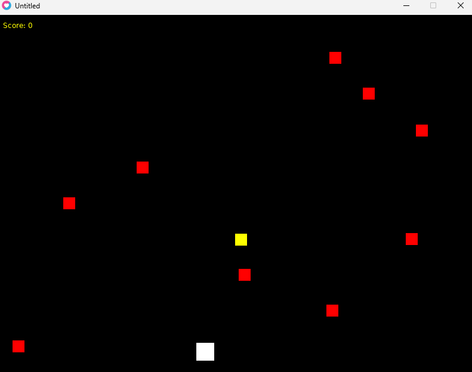

# Lua Game: Avoid Obstacles and Collect Prizes

This is a simple Lua-based game using the Love2D framework. The objective of the game is to avoid falling obstacles while collecting prizes that appear on the screen. The game is controlled using the left and right arrow keys, and you can restart the game by pressing the 'R' key after a game over.

## Requirements

- [Love2D](https://love2d.org/) (version 11.3 or later)

## How to Run the Game

1. Install Love2D if you haven't already.
2. Clone or download this repository to your local machine.
3. Place the `bgm.mp3` file (background music) in the same directory as the game.
4. Run the game using the Love2D framework:
   - Open a terminal/command prompt and navigate to the directory containing the game files.
   - Run the following command:
     ```
     love .
     ```

## Controls

- **Arrow Keys (Left/Right)**: Move the player left or right.
- **R**: Restart the game after a game over.

## Game Features

- **Player**: The player is represented by a white square. The player can move left and right across the screen using the arrow keys.
- **Obstacles**: Red squares fall from the top of the screen, and the player must avoid them. If an obstacle collides with the player, the game ends.
- **Prizes**: Yellow squares appear randomly and fall down. If the player collects a prize, they earn points.
- **Score**: The score increases by 10 points each time the player collects a prize. The score is displayed in the top-left corner of the screen.
- **Game Over**: The game ends if the player collides with an obstacle. Press 'R' to restart the game.

## Example 

  
